# LED Detection & Monitoring System

A robust computer vision system for detecting and monitoring periodic LED flashes ("heartbeats") on embedded devices. Uses advanced adaptive algorithms to remain reliable under varying lighting conditions, including ambient light changes, flashlights, and reflections.

## 🚀 Key Features

### **Adaptive Detection Algorithm**
- **Combined Scoring**: Identifies pixels that are BOTH bright AND changing, using `(brightness × change) / 255` metric
- **Adaptive Baseline**: Continuously updates reference frame to handle slow environmental changes
- **Bidirectional Threshold Adjustment**: Automatically adapts to both increasing AND decreasing ambient light in real-time
- **Contrast vs Brightness Modes**: Choose between `max-median` contrast (robust) or percentile brightness (sensitive)

### **Intelligent Calibration**
- **Automatic ROI Detection**: Finds and locks onto the LED using blob analysis, auto-sizing the region (24×24 to 96×96 pixels)
- **Smart OFF Detection**: Uses variance-based thresholds to detect when LED is OFF, even with rapid flashing
- **Noise Floor Tracking**: Maintains rolling window of background measurements, updates threshold continuously
- **Debug Image Generation**: Automatically saves `debug_detection.png` showing detected ROI and peak location

### **Hardware Support & Optimization**
- **Raspberry Pi 5**: Native `picamera2` support with manual exposure control
- **USB Webcams**: OpenCV-based driver for any standard webcam (Windows/Linux)
- **Cross-Platform**: Tested on Raspberry Pi OS, Ubuntu 24.04, Windows 10/11
- **Rolling Shutter Exploitation**: Detects LED pulses as brief as 1ms by leveraging sequential row exposure
  - CMOS sensors expose rows sequentially over ~10ms (rolling shutter effect)
  - Exposure time (8.3ms) set to half the frame period (16.666ms) for optimal brief pulse capture
  - Brief LED flashes "between frames" are still captured by some sensor rows
  - Critical advantage over global shutter cameras for sub-frame pulse detection

### **Advanced Features (Configurable)**
- **Saturation Logging**: Real-time tracking of sensor saturation (warns when >10% of frames clipped)
- **Adaptive Exposure**: Experimental auto-adjustment of camera exposure to prevent saturation (X86 only)
- **State-Based Pulse Detection**: Detects LED transitions (falling edge) rather than threshold crossings
- **Feature Flags**: All major features can be enabled/disabled via command-line arguments

---

## 📦 Installation

### Raspberry Pi 5 (Bookworm)
Use system-managed Python packages:

```bash
# Update system
sudo apt update && sudo apt upgrade

# Install dependencies
sudo apt install python3-opencv python3-numpy python3-picamera2
```

### x86 Linux (Ubuntu/Debian) / Windows
Use a virtual environment:

```bash
# Create virtual environment
python3 -m venv venv
source venv/bin/activate  # Windows: venv\Scripts\activate

# Install dependencies
pip install opencv-python numpy
```

---

## 🏃 Usage

### Basic Usage (Recommended Defaults)
```bash
python3 src/led_detection/main.py --interval 60 --threshold 50
```

This runs with:
- ✅ Contrast-based detection (robust against lighting changes)
- ✅ Adaptive ROI sizing (handles LEDs at different distances)
- ✅ Adaptive OFF detection (variance-based)
- ✅ Saturation logging (warns of overexposure)
- ✅ Adaptive exposure (auto-adjusts if saturation detected, X86 only)
- ✅ Autofocus (finds optimal focus automatically, X86 only)
- ✅ Bidirectional threshold adaptation (tracks ambient light changes)

### Command-Line Options

**Basic Parameters:**
- `-i, --interval SECONDS` - Maximum expected time between LED pulses (default: 60)
- `-t, --threshold VALUE` - Minimum signal strength for initial LED detection (default: 50)
- `-d, --debug` - Enable debug logging (shows detailed algorithm state)
- `-p, --preview` - Enable 5-second aiming phase with preview window (X86 only)

**Feature Flags (Enabled by Default):**
- `--use-contrast` / `--no-use-contrast` - Use contrast (max-median) vs brightness detection
- `--adaptive-roi` / `--no-adaptive-roi` - Auto-size ROI based on LED blob vs fixed 64×64
- `--adaptive-off` / `--no-adaptive-off` - Variance-based vs fixed 60% drop for OFF detection
- `--log-saturation` / `--no-log-saturation` - Track and display saturation warnings
- `--adaptive-exposure` / `--no-adaptive-exposure` - Auto-adjust camera exposure (X86 only)
- `--autofocus` / `--no-autofocus` - Auto-focus sweep using hill-climbing algorithm (X86 only)

### Example Commands

**Debug mode with preview:**
```bash
python3 src/led_detection/main.py --interval 60 --debug --preview
```

**Low threshold for dim LEDs:**
```bash
python3 src/led_detection/main.py --interval 60 --threshold 25
```

**Revert to original brightness-based algorithm:**
```bash
python3 src/led_detection/main.py --interval 60 \
  --no-use-contrast \
  --no-adaptive-roi \
  --no-adaptive-off
```

**Test adaptive exposure (experimental):**
```bash
python3 src/led_detection/main.py --interval 60 --adaptive-exposure --debug
```

**Batch Classify a Folder of Image Sequences:**
```bash
python3 src/led_detection/main.py --classify-folder ./TestData --output-json ./results.json
```

---

## 🧠 How It Works

The system operates in distinct phases to ensure reliable detection:

### Phase 1: Camera Initialization
- Sets camera to **manual exposure mode** (8.3ms / 1/120s) at **60fps** (16.666ms frame period)
  - **Exploits Rolling Shutter**: Exposure time is HALF the frame period
    - Most cameras use CMOS sensors with rolling shutter (rows exposed sequentially)
    - A 1ms LED pulse occurring anywhere in the 16.666ms frame period will be captured by SOME rows
    - Different rows "see" different time windows as shutter rolls top-to-bottom (~10ms scan time)
    - **Example**: LED flashes for 1ms at t=7ms → Rows 100-150 capture it even though it's "between frames"
    - Global shutter cameras at 60fps might miss brief pulses entirely
  - **Rejects 60Hz AC Flicker**: 8.33ms = half-cycle of 60Hz mains (anti-flicker)
  - **Prevents Auto-Exposure Breathing**: Fixed exposure stops gain hunting that causes false positives
- Locks gain, focus, and white balance
- Optional: 5-second aiming phase with preview window (`--preview`)

### Phase 2: Signal Detection (Adaptive Baseline)
**Establishes Baseline:**
1. Captures 10 frames and computes median → initial baseline
2. Baseline represents "normal" scene without LED

**Scans for LED Signal:**
```
For each frame:
  1. Compute: diff = |frame - baseline|
  2. Track: max_diff[x,y] = max over time
  3. Track: max_brightness[x,y] = max over time
  4. Compute: combined_score = (diff × brightness) / 255
  5. Update: baseline slowly adapts (α=0.1) to handle slow light changes

  If max(combined_score) > threshold:
    → LED detected at location (x, y)
```

**Why Combined Scoring?**
- **Brightness alone** fails with dim LEDs or saturation
- **Change alone** triggers on any motion/flicker
- **Combined metric** requires BOTH → very robust

**Adaptive ROI Locking:**
- Uses connected component analysis on `combined_score` map
- Measures actual blob dimensions
- Sets ROI to 1.1× blob size (constrained: 24×24 to 96×96 pixels)
- Saves `debug_detection.png` with visualization

### Phase 3: Wait for LED OFF
- Monitors ROI using the selected metric (contrast or brightness)
- **Adaptive Mode** (default):
  - Measures 10 samples, computes mean and std
  - Clamps effective std: `min(std, mean × 0.1)` to prevent unreachable thresholds
  - Threshold: `max(mean - 3×effective_std, mean × 0.7)`
  - Works even with rapidly flashing LEDs
- **Fixed Mode** (`--no-adaptive-off`):
  - Waits for value to drop below 60% of initial reading
- Timeout: 15 seconds

### Phase 4: Noise Floor Calibration
- LED is now OFF, captures 30 samples
- Computes:
  ```
  avg_noise_level = mean(samples)
  signal_strength = detected_on_level - avg_noise_level
  initial_threshold = avg_noise_level + (signal_strength × 0.5)
  ```
- Threshold is set **halfway** between OFF and ON states
- Initializes noise floor history (rolling window of 10 samples)

### Phase 5: Adaptive Monitoring ⭐ **Key Innovation**

**Bidirectional Threshold Adaptation:**

The system continuously updates the threshold based on LED state:

```python
# When LED is OFF:
- Record current value → noise_floor_history (rolling window of 10)
- Recalculate: noise_floor = mean(history)
- Update: threshold = noise_floor + (signal_strength × 0.5)

# When LED is stuck ON for >5 seconds:
- Track minimum value seen during ON state
- If min_value > noise_floor + 30% of signal:
    → Ambient light has increased!
    → Add min_value to noise_floor_history
    → Recalculate threshold (raises it)
```

**This handles:**
- Room gradually brightening (sunrise, lights turned on)
- Room gradually dimming (sunset, lights turned off)
- Flashlight shined continuously on scene
- Reflections from moving objects

**State-Based Pulse Detection:**
- Tracks LED state: `ON` vs `OFF`
- Pulse recorded on **falling edge** (ON → OFF transition)
- Displays:
  - `[LED ON]` when active
  - `[WAITING Xs]` when OFF, shows gap since last pulse
  - `[ALARM (Xs)]` when gap exceeds `interval × 1.2`

**Status Output:**
```
[WAITING 12.3s] | Contrast: 45 | Thr: 62 (Floor: 37) | Min/Max: 35/158 | dT: 0.012s
```
- **Contrast/Bright**: Current measured value
- **Thr**: Current detection threshold
- **Floor**: Current noise floor (watch this adapt!)
- **Min/Max**: Value range in last 1-second interval
- **dT**: Time delta between min and max (LED pulse width estimate)
- **[SAT: X%]**: Shows if >10% of frames are saturated

---

## 🔍 Detection Modes

### Contrast Mode (Default, `--use-contrast`)
**Metric:** `max(ROI) - median(ROI)`

**Advantages:**
- ✅ Immune to global illumination changes
- ✅ Works with flashlights shined on scene
- ✅ Robust against ambient light drift
- ✅ Best for challenging lighting conditions

**Disadvantages:**
- ❌ Requires LED to be distinctly brighter than surroundings
- ❌ May fail if entire ROI saturates (all pixels → 255)

**When to Use:**
- Outdoor monitoring (sun position changes)
- Environments with variable lighting
- When flashlight interference is expected

### Brightness Mode (`--no-use-contrast`)
**Metric:** `percentile_90(ROI)`

**Advantages:**
- ✅ More sensitive to dim LEDs
- ✅ Works with very small LEDs (few pixels)
- ✅ Simpler, more predictable behavior

**Disadvantages:**
- ❌ Sensitive to ambient light changes
- ❌ Fails when flashlight shined on scene
- ❌ Requires stable lighting conditions

**When to Use:**
- Controlled indoor environment
- Very dim LEDs that need maximum sensitivity
- Stable lighting conditions

### Batch Offline Classification (`--classify-folder`)

Recursively scans a directory tree for image sequences and generates a classification report.

**Features:**
- **Blind Detection**: Detects pulses without knowing expected period/duration.
- **Robust Parsing**: Handles various filename formats (fallback to 30 FPS).
- **Metadata Extraction**: Identifies AED type ("CR2" vs "Philips") and repeat interval.
- **JSON Output**: Produces a detailed report for automation.

**Example Output (`results.json`):**
```json
[
    {
        "name": "3598_run1_phoneflash_bright",
        "directory": "TestData/CR2/3598_run1_phoneflash_bright",
        "expected_count": 2,
        "expected_frames": [79, 261],
        "repeat_interval_sec": 2.0,
        "aed_type": "CR2"
    }
]
```

---

## 🛠️ Troubleshooting

### LED Never Detected (Scanning Times Out)

**Check `debug_detection.png`:**
```bash
# After a failed scan, check the generated image
ls -lh debug_detection.png
```

**Possible Causes:**
1. **LED too dim**: Lower threshold → `--threshold 25`
2. **LED out of focus**: Adjust camera focus manually, or enable `--preview` to aim
3. **LED not changing**: System requires BOTH brightness AND change
   - Ensure LED is actually flashing during scan (first 70 seconds)
4. **Wrong metric**: Try brightness mode → `--no-use-contrast`

### False Alarms / Missed Pulses

**Symptoms:** Shows `[ALARM]` but LED is flashing normally

**Possible Causes:**
1. **Saturation**: Look for `[SAT: X%]` in output
   - Solution: Enable `--adaptive-exposure` or reduce LED brightness
   - Solution: Increase camera distance or add ND filter
2. **Threshold too high/low**: Watch the `Floor:` value in output
   - Should track ambient light changes
   - If stuck, try `--debug` to see threshold updates
3. **LED flash too brief**: Check `dT` value (should match LED pulse width)
   - If `dT < 10ms`, LED may be too fast for camera framerate

### Saturation / Contrast Blindness (High Brightness LED)

**Symptoms:** LED detection becomes erratic or fails when LED brightness increases to 100%.
- Logs show `[SAT: 90%+]`
- Contrast score drops to near zero despite bright LED

**Cause:**
- The LED bloom fills the entire ROI (Region of Interest)
- Both `max(ROI)` and `median(ROI)` become 255 (saturated)
- `Contrast = Max - Median = 255 - 255 = 0`
- The system thinks the LED is OFF because there is no contrast *within* the ROI

**Solution:**
- **Adaptive Exposure (Enabled by Default):** Automatically reduces exposure time when saturation is detected, restoring contrast.
- **Increase ROI Size:** Disable adaptive ROI (`--no-adaptive-roi`) to use a larger fixed box that isn't filled by the bloom.

### Flashlight Interference (Contrast Mode)

**Expected Behavior:** System should continue detecting LED even when flashlight is shined on scene

**If it fails:**
1. Check saturation: `[SAT: X%]` should appear
2. If saturation >50%, sensor is clipping:
   - Try `--adaptive-exposure`
   - Reduce flashlight brightness
   - Increase camera distance
3. Watch `Floor:` value - should increase when flashlight is shined

### Gradual Drift (Brightness Changing Over Time)

**Expected Behavior:** `Floor:` value should track ambient changes

**Monitor in debug mode:**
```bash
python3 src/led_detection/main.py --interval 60 --debug
# Watch for log messages: "Updating noise floor: X → Y"
```

**If threshold doesn't adapt:**
- Verify `--adaptive-off` is enabled (default)
- Check that LED has OFF periods (system needs OFF state to update)
- Very slow changes (<1% per minute) may take time to track

### Debug Image Shows Wrong ROI

**Check adaptive ROI:**
```bash
# Run with debug logging
python3 src/led_detection/main.py --interval 60 --debug

# Look for log line:
# [INFO] Adaptive ROI: Blob=12x8, RawHalf=6, FinalHalf=12
```

**If ROI is wrong:**
- Try fixed ROI: `--no-adaptive-roi`
- Adjust threshold to get cleaner blob: `--threshold 60`
- Check that LED is in focus (sharp point, not diffuse blob)

---

## 📊 Feature Flag Reference

| Flag | Default | Purpose | When to Change |
|------|---------|---------|----------------|
| `--use-contrast` | ✅ ON | Use max-median metric | Disable for dim LEDs in stable lighting |
| `--adaptive-roi` | ✅ ON | Auto-size ROI based on blob | Disable if ROI detection fails |
| `--adaptive-off` | ✅ ON | Variance-based OFF detection | Disable for very stable LED timing |
| `--log-saturation` | ✅ ON | Track sensor saturation | Disable to reduce log spam |
| `--adaptive-exposure` | ✅ ON | Auto-adjust camera exposure | Disable if exposure oscillates |
| `--autofocus` | ✅ ON | Auto-focus sweep (X86 only) | Disable to use manual focus |

**To disable a feature:**
```bash
python3 src/led_detection/main.py --interval 60 --no-use-contrast
```

**To enable experimental features:**
```bash
python3 src/led_detection/main.py --interval 60 --adaptive-exposure
```

---

## 🎯 Algorithm Flow Chart

```mermaid
flowchart TD
    Start([Start Detection]) --> Init[Camera Initialization<br/>Manual exposure, 60fps<br/>Disable HW autofocus]
    Init --> Preview{Preview<br/>Mode?}
    Preview -->|Yes| Aim[5s Aiming Phase<br/>Preview Window]
    Preview -->|No| AutofocusCheck
    Aim --> AutofocusCheck

    AutofocusCheck{Autofocus<br/>Enabled?}
    AutofocusCheck -->|Yes X86| AF[Hill-Climbing Autofocus<br/>Phase 1: Coarse scan 0-1023<br/>Phase 2: Binary search refinement]
    AutofocusCheck -->|No/RPi| SignalDetect
    AF --> LockFocus[Lock Focus Position<br/>Disable HW autofocus 3x<br/>Verify locked]
    LockFocus --> SignalDetect

    SignalDetect[Signal Detection Phase<br/>Adaptive Baseline]
    SignalDetect --> Baseline[Establish Baseline<br/>Median of 10 frames]
    Baseline --> Scan[Scan for LED Signal]

    Scan --> ScanLoop{For Each<br/>Frame}
    ScanLoop --> CalcDiff["Calculate diff = abs(frame - baseline)"]
    CalcDiff --> TrackMax[Track max_diff and max_brightness]
    TrackMax --> Combined[combined_score = diff × brightness / 255]
    Combined --> AdaptBase[Slowly adapt baseline α=0.1]
    AdaptBase --> CheckScore{combined_score<br/>> threshold?}

    CheckScore -->|No| ScanLoop
    CheckScore -->|Yes| DetectedLED[LED Detected at x,y]
    DetectedLED --> ROILock[Lock ROI using Blob Analysis<br/>Measure blob dimensions<br/>Set ROI = 1.1× blob size 24-96px]
    ROILock --> SaveDebug[Save debug_detection.png]
    SaveDebug --> WaitOFF

    WaitOFF[Wait for LED OFF Phase]
    WaitOFF --> AdaptiveOFF{Adaptive OFF<br/>Mode?}
    AdaptiveOFF -->|Yes| VarThresh[Measure 10 samples<br/>Threshold = max mean - 3×std, mean×0.7]
    AdaptiveOFF -->|No| FixedThresh[Wait for value < 60% initial]
    VarThresh --> OFFDetected[LED is OFF]
    FixedThresh --> OFFDetected

    OFFDetected --> CalibExposure{Adaptive<br/>Exposure?}
    CalibExposure -->|Yes X86| AdjustExp[Calibrate Exposure<br/>Reduce if >50% saturated]
    CalibExposure -->|No| NoiseCalib
    AdjustExp --> NoiseCalib

    NoiseCalib[Noise Floor Calibration<br/>30 samples while LED OFF]
    NoiseCalib --> CalcNoise[avg_noise = mean samples<br/>signal_strength = ON - noise<br/>threshold = noise + signal×0.5]
    CalcNoise --> InitHistory[Initialize noise_floor_history<br/>Rolling window of 10]
    InitHistory --> Monitor[Adaptive Monitoring Loop]

    Monitor --> GetFrame[Get Frame]
    GetFrame --> MeasureROI[Measure ROI<br/>Contrast: max-median<br/>Brightness: percentile_90]
    MeasureROI --> CheckSat{Log<br/>Saturation?}
    CheckSat -->|Yes| TrackSat[Track saturation %<br/>Adaptive exposure if needed]
    CheckSat -->|No| CheckState
    TrackSat --> CheckState

    CheckState{LED<br/>State?}
    CheckState -->|OFF| UpdateNoise[Add value to noise_floor_history<br/>Recalculate threshold<br/>threshold = noise_floor + signal×0.5]
    CheckState -->|ON| CheckStuck

    CheckStuck{ON for<br/>> 5s?}
    CheckStuck -->|Yes| AmbientCheck{min_value ><br/>noise + 30%?}
    CheckStuck -->|No| Transition
    AmbientCheck -->|Yes| RaiseThresh[Ambient light increased!<br/>Add min to history<br/>Threshold rises]
    AmbientCheck -->|No| Transition
    RaiseThresh --> Transition
    UpdateNoise --> Transition

    Transition{val crosses<br/>threshold?}
    Transition -->|OFF→ON| LEDOn[LED State = ON<br/>Record ON time]
    Transition -->|ON→OFF| PulseDetect[PULSE DETECTED!<br/>Record gap and duration]
    Transition -->|No Change| Display
    LEDOn --> Display
    PulseDetect --> CheckAlarm

    CheckAlarm{gap ><br/>interval×1.2?}
    CheckAlarm -->|Yes| Alarm[Display ALARM]
    CheckAlarm -->|No| Display
    Alarm --> Display

    Display[Display Status<br/>Contrast/Bright, Threshold<br/>Floor, Min/Max, dT, SAT%] --> GetFrame

    style Start fill:#e1f5e1
    style AF fill:#fff4e6
    style LockFocus fill:#fff4e6
    style DetectedLED fill:#e3f2fd
    style PulseDetect fill:#f3e5f5
    style Alarm fill:#ffebee
    style Monitor fill:#e8f5e9
```



### Algorithm Phase Summary

**Phase 0: Camera Initialization**
- Set manual exposure (8.3ms) at 60fps
- Disable hardware autofocus
- Optional: 5s aiming phase with preview

**Phase 0b: Autofocus (X86 Only)**
- Hill-climbing algorithm with coarse scan + binary search
- Finds optimal focus position (0-1023)
- Locks focus by disabling HW autofocus 3 times

**Phase 1: Signal Detection**
- Adaptive baseline tracks environment
- Combined scoring: (brightness × change) / 255
- Blob analysis determines ROI size (24-96 pixels)

**Phase 2: Wait for LED OFF**
- Variance-based (adaptive) or fixed threshold
- Confirms LED can turn off

**Phase 2b: Exposure Calibration**
- Reduces exposure if >50% frames saturated

**Phase 3: Noise Floor Calibration**
- 30 samples while LED is OFF
- Calculates initial threshold = noise + signal × 0.5

**Phase 4: Adaptive Monitoring**
- **When LED is OFF**: Updates noise floor from current readings
- **When LED stuck ON >5s**: Detects ambient light increase
- **Pulse Detection**: Records ON→OFF transitions (falling edge)
- **Bidirectional Threshold**: Adapts to both brighter and dimmer environments

---

## 🏆 Performance Characteristics

### Timing
- **Frame Rate**: 30-60 fps (camera dependent)
- **Detection Latency**: <100ms (limited by frame rate)
- **Minimum Pulse Width**: ~1ms (thanks to rolling shutter!)
  - Rolling shutter scans sensor over ~10ms
  - Brief pulses captured by some rows even if "between frames"
  - Global shutter would require 16ms minimum (1 full frame at 60fps)
- **Threshold Update Rate**: Every frame when LED is OFF

### Robustness
- **Ambient Light Changes**: Tracks ±50% changes in real-time
- **Flashlight Interference**: Handles 2-3× brightness increase (contrast mode)
- **LED Distance**: 10cm to 5m+ (depends on LED brightness)
- **LED ON/OFF Ratio**: 1.5:1 to 100:1 (adaptive thresholds)

### Hardware Requirements
- **CPU**: Any modern ARM/x86 (tested on RPi5, i5-8250U)
- **RAM**: ~50MB
- **Storage**: Minimal (<1MB logs, 40KB debug image)

---

## 📝 Development

### Running Tests
```bash
pytest
```

### Code Quality
```bash
# Install dev dependencies
pip install -e .[dev]

# Install pre-commit hooks
pre-commit install

# Run linting
pylint src/led_detection/main.py
```

### Project Structure
```
led_detection/
├── src/
│   └── led_detection/
│       └── main.py          # Main application
├── tests/
│   └── test_main.py         # Unit tests
├── debug_detection.png      # Auto-generated debug output
├── README.md                # This file
└── pyproject.toml          # Project configuration
```

---

## 🤝 Contributing

This project was developed through collaborative iteration with Claude and Gemini AI assistants. Contributions are welcome!

### Known Limitations
- **Global Shutter Cameras**: System is optimized for rolling shutter (CMOS sensors)
  - Global shutter cameras (e.g., some industrial cameras) won't capture sub-frame pulses (<16ms)
  - Brief LED flashes may be missed entirely if they occur between frame captures
  - Rolling shutter cameras (standard in RPi/USB webcams) provide superior brief pulse detection
- Adaptive exposure may oscillate with some webcams (experimental)
- Minimum LED size: ~5 pixels (for blob detection)
- Maximum framerate: Limited by camera hardware
- Raspberry Pi Camera Module: Manual focus requires hardware adjustment

### Future Improvements
- Multi-LED tracking (currently single LED only)
- Frequency domain analysis for sub-frame pulse detection
- GPU acceleration for higher frame rates
- Machine learning-based LED classification

---

## 📄 License

MIT License - See LICENSE file for details

---

## 🙏 Acknowledgments

Developed with assistance from:
- **Claude (Anthropic)**: Algorithm design and implementation
- **Gemini (Google)**: Testing, debugging, and refinement
- **OpenCV Community**: Computer vision primitives
- **Raspberry Pi Foundation**: picamera2 library
